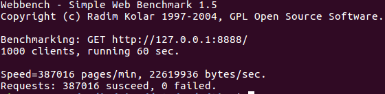

# Tiny Web Server

## Introduction  
C++11编写的轻量级Web服务器，基于事件驱动实现了线程的异步唤醒，使用状态机解析了get、head请求，可处理静态资源，并实现了异步日志，无任何第三方库。

## Envoirment  
* OS: Ubuntu 16  
* Complier: g++ 4.8  
  
## Build  
make

## Usage  
make test  
curl 127.0.0.1:8888  

## Code  
.    
├── file  
|   ├── file\_logger.cpp  
|   └── tiny\_file\_io.cpp  
├── http  
|   └── http\_protocol.cpp  
├── os  
|   └── tiny\_threadpool.cpp  
├── route  
|   ├── tiny\_handler.cpp  
|   └── tiny\_router.cpp  
├── socket  
|   ├── tiny\_event.cpp  
|   └── tiny\_socket.cpp  
└── tiny\_core.cpp  

## Test  
  
